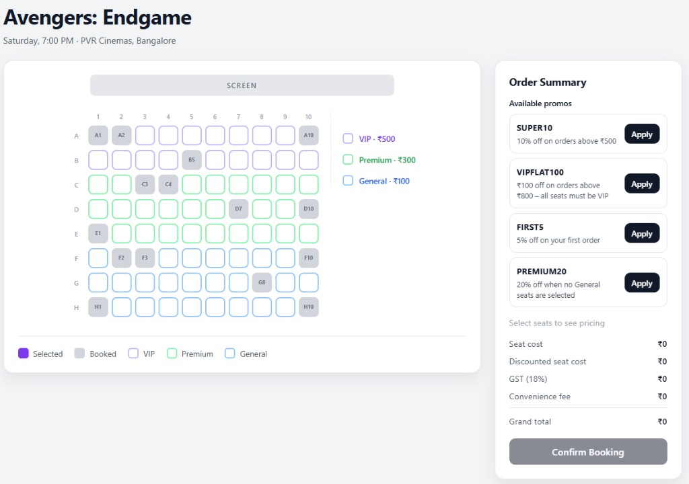

# Theatre Seats

A movie theatre seat booking UI built with React and TypeScript. Pick seats on an interactive grid, apply promo codes, review a full bill breakdown, and confirm bookings — all in the browser with no backend.



## Features

- **Interactive seat map** — 8×10 grid with VIP, Premium, and General pricing tiers, color-coded by category
- **Seat selection** — Toggle available seats, deselect all, and enforce a per-booking seat limit (default: 6)
- **Adjacency warning** — Alerts when selected seats span multiple rows so groups know they may not sit together
- **Promo codes** — Percentage and flat discounts with conditional rules (minimum order, category requirements, first-order-only, excluded categories)
- **Bill breakdown** — Seat costs by category, promo discount, GST, and convenience fee (waived above a threshold)
- **Multiple bookings** — Confirm a booking, see a summary with booking ID, and book more seats in the same session
- **Accessibility** — Semantic markup and ARIA labels on key sections

## Tech Stack

- [React 19](https://react.dev/) with the [React Compiler](https://react.dev/learn/react-compiler)
- [TypeScript](https://www.typescriptlang.org/)
- [Vite](https://vite.dev/) for dev server and production builds
- [Vitest](https://vitest.dev/) + [Testing Library](https://testing-library.com/) for unit and component tests

## Getting Started

### Prerequisites

- Node.js 18+

### Install

```bash
npm install
```

### Development

```bash
npm run dev
```

Open the URL shown in the terminal (typically `http://localhost:5173`).

### Build

```bash
npm run build
```

### Preview production build

```bash
npm run preview
```

### Tests

```bash
npm run test        # watch mode
npm run test:run    # single run
```

### Lint

```bash
npm run lint
```

## Project Structure

```
src/
├── components/       # UI (seat grid, order summary, promo input, etc.)
├── config/
│   └── showConfig.ts   # Show, venue, seat layout, pricing, promo codes
├── hooks/
│   └── useSeatBooking.ts   # Booking state and actions
├── lib/              # Pure logic (pricing, promos, seats, selection)
├── styles/
│   └── booking.css
├── types/
│   └── booking.ts    # Shared TypeScript types
└── test/
    └── setup.ts
```

Business logic lives in `src/lib/` and is covered by unit tests. UI state is managed by the `useSeatBooking` hook, which composes those utilities.

## Configuration

Show details, seat layout, and pricing are defined in `src/config/showConfig.ts`. The default demo is *Avengers: Endgame* at PVR Cinemas, Bangalore.

| Setting | Default |
| --- | --- |
| Grid size | 8 rows × 10 columns |
| VIP (rows A–B) | ₹500 |
| Premium (rows C–E) | ₹300 |
| General (rows F–H) | ₹100 |
| Max seats per booking | 6 |
| Convenience fee | ₹49 (waived when discounted seat cost > ₹1000) |
| GST | 18% |

Pre-booked seats are listed in `bookedSeats`. After a user confirms a booking, those seats are marked unavailable for the rest of the session.

## Promo Codes

| Code | Discount | Conditions |
| --- | --- | --- |
| `SUPER10` | 10% off | Order ≥ ₹500 |
| `VIPFLAT100` | ₹100 off | Order ≥ ₹800, all seats VIP |
| `FIRST5` | 5% off | First confirmed booking only |
| `PREMIUM20` | 20% off | No General seats selected |

Promo validation re-runs when seats change; invalid promos are removed automatically with an error message.

## How Pricing Works

1. Sum seat prices by category
2. Apply promo discount (percentage rounded, flat capped at seat cost)
3. Calculate GST on the discounted amount
4. Add convenience fee unless the discounted seat cost exceeds the waiver threshold
5. Grand total = discounted seat cost + GST + convenience fee

## License

Private project — not published to npm.
